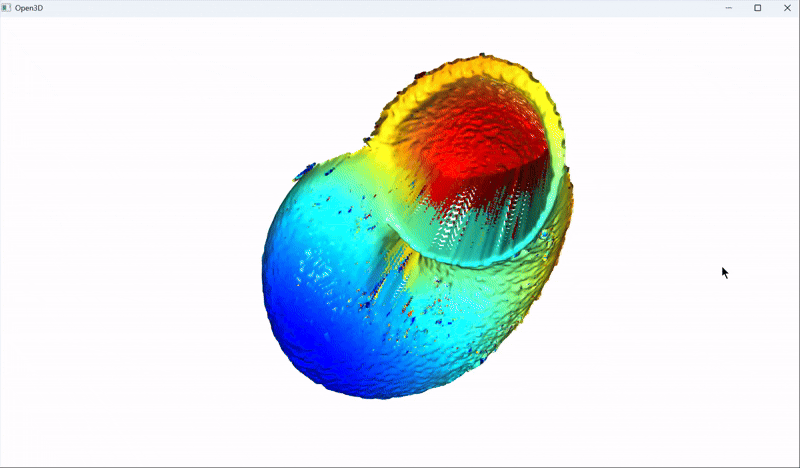
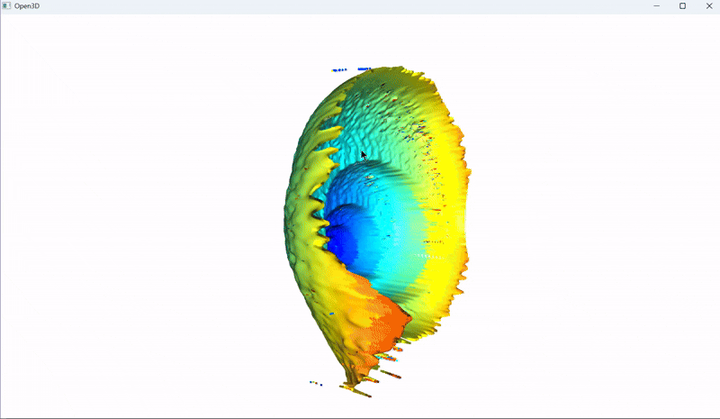

[中文版本](README_ZH.md)

# Background Introduction

The `img` folder contains a set of snail photos taken from four different angles. Each angle's photos are captured by scanning upward at equal intervals. Some areas appear blurred due to being out of the focal plane.

# Reconstruction Approach

The 3D reconstruction process of this project is as follows:

1. **Image Preprocessing**  
   - Compress the image size to reduce computational load.
   - Perform linear interpolation along the z-axis to expand data in the z-direction.

2. **Feature Extraction**  
   - Extract features layer by layer from each image to identify clear regions:
     - Convert the image to grayscale.
     - Use the Laplacian operator to calculate the second derivative and extract edge features.
     - Apply mean filtering with a small window to reduce noise.

3. **Multi-Focus Image Generation**  
   - Extract the clearest part of each layer and synthesize a multi-focus image.
   - Map the depth information based on the layer of the clearest part.

4. **Point Cloud Generation**  
   - Assume an intrinsic camera matrix to convert depth information into point cloud data.
   - Due to the unknown intrinsic matrix, the generated point cloud shape may have errors and cannot fit into an accurate 3D model.
   - If the correct intrinsic matrix is provided, a perfect 3D reconstruction result can be achieved.

# Final Results

Below are the results generated by the project:

<table>
    <tr>
        <td></td>
        <td></td>
    </tr>
    <tr>
        <td></td>
        <td></td>
    </tr>
</table>

# File Structure

- `img/`: Folder containing snail photos.
- `gif/`: Folder containing GIFs for final results.
- `point_cloud/`: Folder containing point cloud data

# Notes

- To generate accurate 3D reconstruction results, the real camera intrinsic matrix must be provided.
- Ensure the input image quality is high enough to improve reconstruction results.
