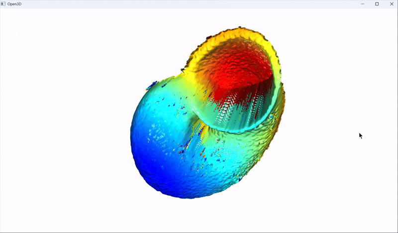
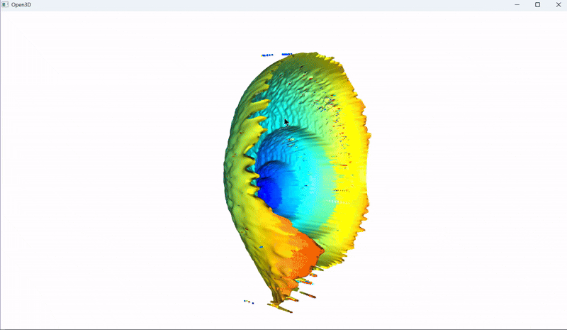
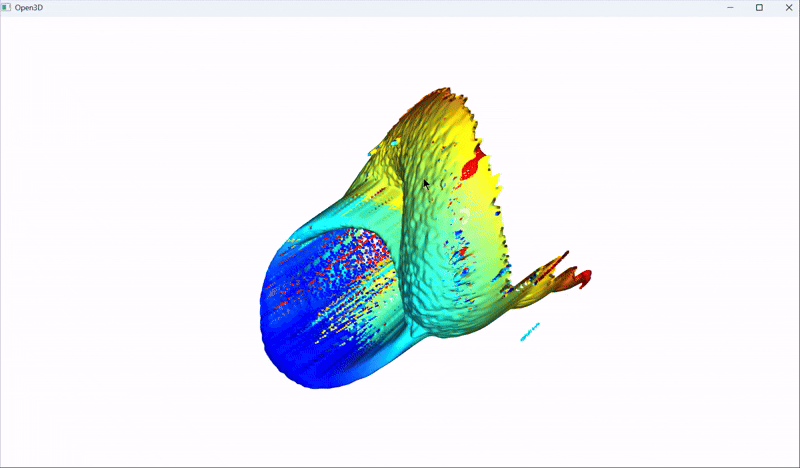
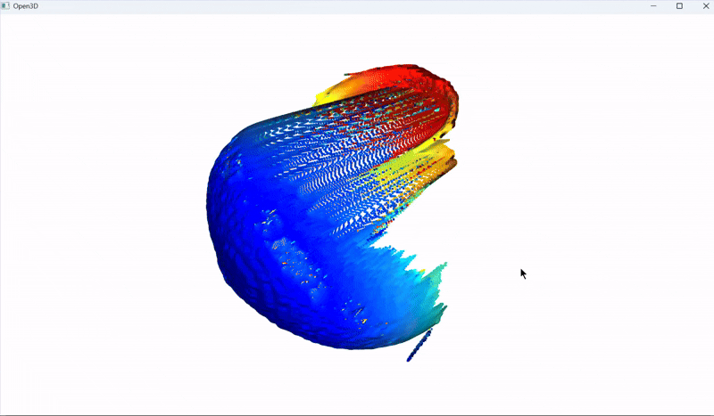

## 背景介绍

`img` 文件夹中存放了一组蜗牛的照片，共有四个角度。每个角度的照片均为从下往上等距扫描拍摄，部分区域因不在焦平面而出现弥散现象。

## 重建思路

本项目的三维重建流程如下：

1. **图片预处理**  
   - 压缩图片大小以减少计算量。
   - 在 z 轴方向进行线性插值，扩充 z 轴方向的数据信息。

2. **特征提取**  
   - 对每张图片逐层提取特征，识别清晰区域：
     - 将图片转为灰度图。
     - 使用拉普拉斯算子计算二阶导数，提取边缘特征。
     - 为降低噪声，采用小窗口对计算结果进行均值滤波。

3. **多焦点图像生成**  
   - 提取每一层的最清晰部分，合成一张多焦点图像。
   - 根据清晰部分所在的层数，映射生成深度信息。

4. **点云生成**  
   - 假设一个内参矩阵，将深度信息转换为点云数据。
   - 由于未知真实内参矩阵，生成的点云形状可能存在误差，无法拟合为精确的三维图像。
   - 若提供正确的内参矩阵，可生成完美的三维重建结果。

## 最终效果

以下为项目生成的效果展示：

<table>
    <tr>
        <td></td>
        <td></td>
    </tr>
    <tr>
        <td></td>
        <td></td>
    </tr>
</table>

## 文件结构

- `img/`：存放蜗牛照片的文件夹。
- `gif/`：存放最终效果展示的 GIF 文件夹。
- `point_cloud/`：存放点云的文件夹

## 注意事项

- 若需生成精确的三维重建结果，需要提供真实的相机内参矩阵。
- 确保输入图片质量足够高，以提高重建效果。